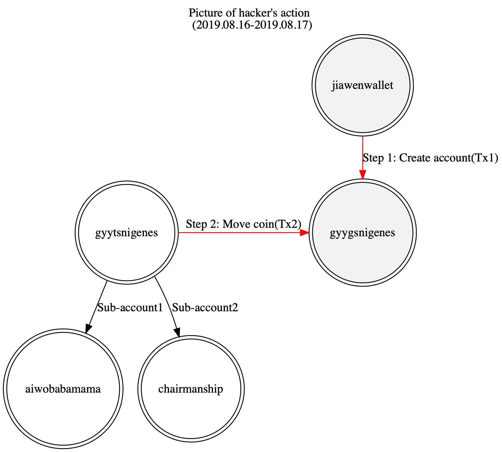
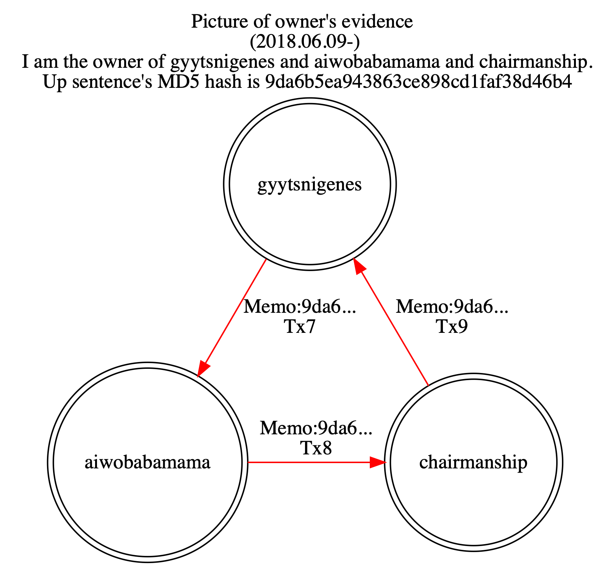
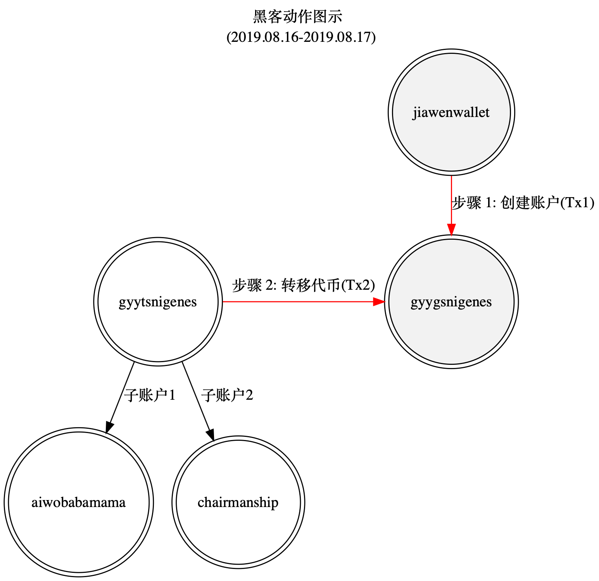
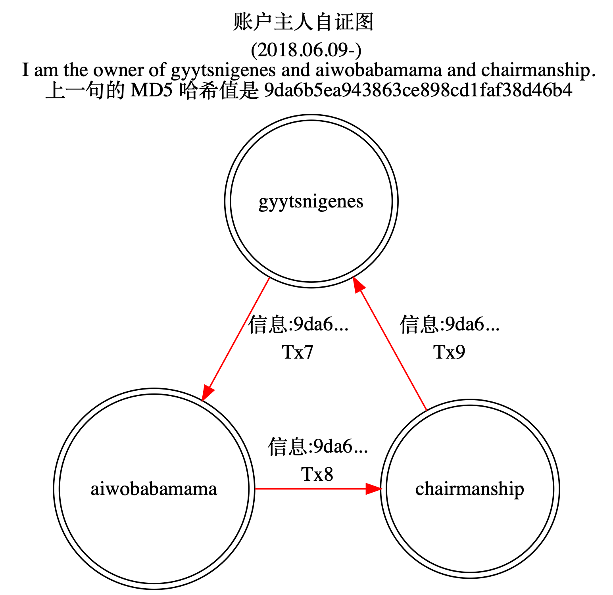

Question: Should we return a well-proofed stolen EOS coin back to original holder?/是否应该归还充分证明的失窃代币？  
Language of Record: English  
Proposers: Ashah Chen, databingo@foxmail.com, Account: gyytsnigenes  
Dscription of Referendum: Return a well-proofed stolen EOS coin back to original holder  

# Dear EOS BPs:
I am a EOS user, I have a report about lost private key. I need you help to frozen then move back my EOS coin. The Situation, Proof and Request as below.
# 1. Situation
My EOS account “gyytsnigenes” was created at EOS launched time. I have about 33620 EOS in it. At Aug 16, 2019, a user “jiawenwallet” created a similar account “gyygsnigenes”([Tx1](https://eosflare.io/tx/6E72676101976AF81ABCB8E4801B03CA50C1199E0DB36A40F879E9CBE949DBF9)), three minutes later, someone moved my 33620 EOS into it ([Tx2](https://eosflare.io/tx/54D8FFF2F02257D0B4872394D8673D0A6F8B38669D834B6B7BCE281513142804)). I found this action at Oct 2019, I’m sure someone got my private key because I never do such transfer. I immediately changed the private key of “gyytsnigenes”, then collected other EOS in sub-account “chairmanship”([Tx3](https://eosflare.io/tx/FB78FF4D355CC436226519BB7687DF3CA508549F111D9D4C0C9228EAA6A92B8A)) and “aiwobabamama”([Tx4](https://eosflare.io/tx/3D0A4EED41E1076254E05F1C2F04FD5E5714796C525D6C754C8C3B7EE48EB73B)) to “gyytsnigenes”. Now “gyytsnigenes” is safe with some EOS in it.

 

# 2. Proofs
- I have the original key pair of “gyytsnigenes”, both owner and active keys.
- I have the key pair of sub-accounts “aiwobabamama” and ”chairmanship” of “gyytsnigenes”. Those sub-accounts were created by myself before “gyytsnigenes" was attacked(tx5, tx6).
- I have done several transactions with memo “9da6b5ea943863ce898cd1faf38d46b4” the hash of sentence “I am the owner of gyytsnigenes and aiwobabamama and chairmanship.” from “gyytsnigenes” to “aiwobabamama” to “chairmanship” then to “gyytsnigenes” as proofs that I am the owner(tx7, tx8, tx9).

 

# 3. Request
I invite you BPs to check this situations, proofs and requests. For EOS holder’s rights, I ask your vote for the proposal “returnstolen” to frozen fake account “gyygsnigenes” immediately then change gyygsnigenes’s pub keys to gyytsnigenes’s. The coin belongs to two old men, they work half life’s money.
# 4. Transctions
tx1: 6e72676101976af81abcb8e4801b03ca50c1199e0db36a40f879e9cbe949dbf9  
tx2: 54d8fff2f02257d0b4872394d8673d0a6f8b38669d834b6b7bce281513142804  
tx3: fb78ff4d355cc436226519bb7687df3ca508549f111d9d4c0c9228eaa6a92b8a  
tx4: 3d0a4eed41e1076254e05f1c2f04fd5e5714796c525d6c754c8c3b7ee48eb73b  
tx5: 7d1fdd11f1ebb53c2ed7a86b8af548b2c307c045ad2e652207322cc7742bf0fa  
tx6: 1877ed94dafdeee92a6a912bbc4ad404a0ad2da6ff91ad447a4c7679faf4ba71  
tx7: a1f7489af1a84e4251b88b1cb81a36159b46c90515ca8661d37d5a79549a8337  
tx8: 757e5460eb471d73b67a917c3e55608a576d68d1ad3201230c2345e55ab92348  
tx9: 86c59dd37dbdf90689d7dda24188e565ab286a0111d8f194e8e12aa7c4aeb834  

Best Wishes.  
Ashah Chen   
11/6/2019  

# 尊敬的 EOS 区块生产者:
我是一个 EOS 用户，我有一个关于私钥失窃的报告。我需要各位帮忙冻结并转回失窃的 EOS。具体情况、证据和请求如下。
# 1. 情况
我的 EOS 账户 “gyytsnigenes” 创建于 EOS 主网启动时，保存有大概 33620 个 EOS。2019 年 8 月 16 日夜晚， 一个名为 "jiawenwallet" 的账户创建了一个相似的账户 “gyygsnigenes”(tx1)，三分钟之后，我的 33602 个 EOS 就被转移到 “gyygsnigenes” 里面(tx2)。我在 2019 年 10 月发现了这个动作，我可以确定有人偷走了我的私钥，因为我从来没有做过这个转账操作。我立刻修改了 “gyytsnigenes” 的私钥，把下级账户 “chairmanship” 和 “aiwobabamama” 的 EOS 收集回 “gyytsnigenes” （tx3，tx4）。现在 “gyytsnigenes” 处于安全状态，并存有一些 EOS。

 

# 2. 证据
- 我拥有账户 “gyytsnigenes” 的原始公私钥对，包括 owner 和 active 公私钥对。
- 我有 “gyytsnigenes” 下级账户 “aiwobabamama” 和 ”chairmanship” 的公私钥对。这两个账户是我在 “gyytsnigenes" 被攻击之前创建的。
- 我已经做了附加信息为 “9da6b5ea943863ce898cd1faf38d46b4” 的若干转账，从 “gyytsnigenes” 到 “aiwobabamama” 到 “chairmanship” 再到 “gyytsnigenes”。 “9da6b5ea943863ce898cd1faf38d46b4” 是英文句子 “I am the owner of gyytsnigenes and aiwobabamama and chairmanship.” 的 MD5 哈希值，意思是“我是账户 gyytsnigenes 和 aiwobabamama 和 chairmanship 的主人”，以作为我是账户原本主人的证明(tx7, tx8, tx9)。

 

# 3. 请求
我请求各位区块生产者检查这些情况、证据和请求。作为 EOS 持有者的权利，我请求您对名为 “returnstolen” 的提案投赞成票，提案通过之后立即冻结偷盗账户 “gyygsnigenes” 并更改其公钥为 “gyytsnigenes” 的公钥。这些失窃的代币属于两位老人，他们半辈子辛苦劳作所积攒的财富。  

# 4. 相关交易
tx1: 6e72676101976af81abcb8e4801b03ca50c1199e0db36a40f879e9cbe949dbf9  
tx2: 54d8fff2f02257d0b4872394d8673d0a6f8b38669d834b6b7bce281513142804  
tx3: fb78ff4d355cc436226519bb7687df3ca508549f111d9d4c0c9228eaa6a92b8a  
tx4: 3d0a4eed41e1076254e05f1c2f04fd5e5714796c525d6c754c8c3b7ee48eb73b  
tx5: 7d1fdd11f1ebb53c2ed7a86b8af548b2c307c045ad2e652207322cc7742bf0fa  
tx6: 1877ed94dafdeee92a6a912bbc4ad404a0ad2da6ff91ad447a4c7679faf4ba71  
tx7: a1f7489af1a84e4251b88b1cb81a36159b46c90515ca8661d37d5a79549a8337  
tx8: 757e5460eb471d73b67a917c3e55608a576d68d1ad3201230c2345e55ab92348  
tx9: 86c59dd37dbdf90689d7dda24188e565ab286a0111d8f194e8e12aa7c4aeb834  

此致 敬礼   
陈先生  
2019.11.6  
